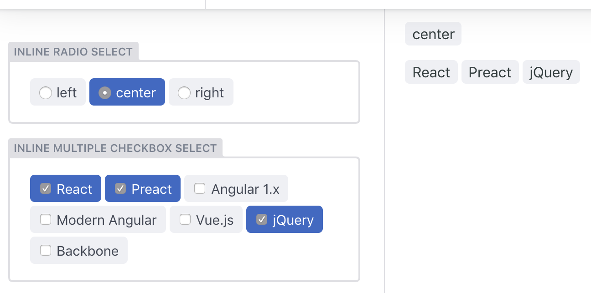

# netlify-cms-widget-inline-select

[![npm version][version-badge]][version]

[![License: MIT][license-badge]][license]
[![code style: prettier][code-style-badge]][code-style]

Inline radio + multi-checkboxes select widget. Check out [the demo](https://netlify-cms-widget-inline-select.netlify.com/demo)!



## Install

```shell
npm i netlify-cms-widget-inline-select
```

or

```shell
yarn add netlify-cms-widget-inline-select
```

## Setup

```js
import { InlineSelectControl, InlineSelectPreview } from 'netlify-cms-widget-inline-select';

CMS.registerWidget('inline-select', InlineSelectControl, InlineSelectPreview);
```

## How to use

Add to your Netlify CMS configuration:

```yaml
fields:
  - name: radio_select
    label: Radio select
    widget: inline-select
    options: ['left', 'center', 'right']
```

## Configuration

- `options` - selection list (you can also specify the `value` and `label` separately)

```yaml
fields:
  - name: radio_select
    label: Most recent framework
    widget: inline-select
    options:
      - { value: react, label: React }
      - { value: angular, label: Angular 1.x }
      - { value: vue, label: Vue.js }
      - { value: $, label: jQuery }
```

- `multiple` - ability to select multiple items

```yaml
fields:
  - name: checkboxes_select
    label: Favorite frameworks
    widget: inline-select
    multiple: true
    options: ['React', 'Angular', 'Vue', 'Other']
```

[version-badge]: https://badge.fury.io/js/netlify-cms-widget-inline-select.svg
[version]: https://www.npmjs.com/package/netlify-cms-widget-inline-select
[license-badge]: https://img.shields.io/badge/License-MIT-yellow.svg
[license]: https://opensource.org/licenses/MIT
[code-style-badge]: https://img.shields.io/badge/code_style-prettier-ff69b4.svg
[code-style]: https://github.com/prettier/prettier
[unpkg-bundle]: https://unpkg.com/netlify-cms-widget-inline-select/lib/
